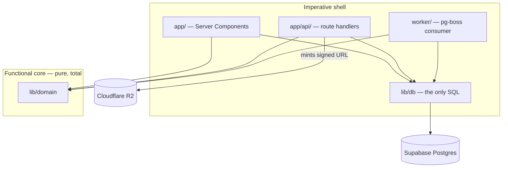
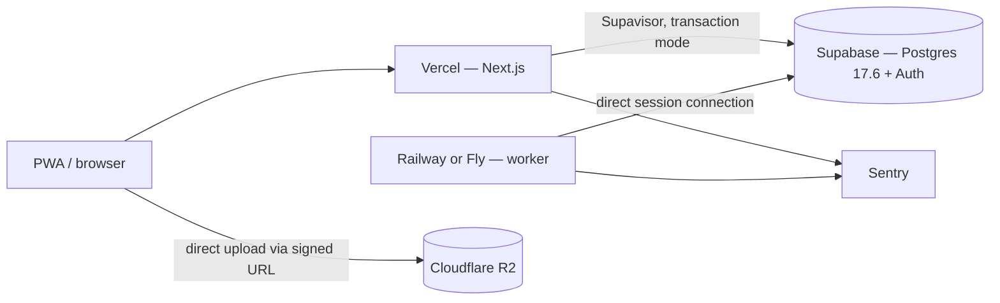
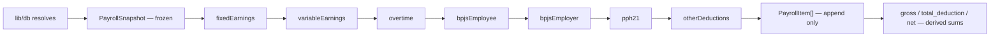

# Architecture Spine — Aira

## Design Paradigm

**Functional core, imperative shell.** `lib/domain` is pure and total: no I/O, no clock, no randomness, no database. Every effect lives at an edge — `lib/db`, route handlers, worker jobs. Within the core, payroll is **pipes-and-filters** over an append-only item list.

| Layer | Directory | May perform I/O |
|---|---|---|
| Core | `lib/domain/` | no |
| Data edge | `lib/db/` | yes — the only place SQL lives |
| Request edge | `app/`, `app/api/` | yes |
| Job edge | `worker/` | yes |



**No edge ever points out of `core`.** That is AD-2, and it is the rule the whole paradigm rests on.

## Inherited Invariants

Settled in `SPEC-aira-hris-payroll` and binding here. Not re-derived, not reopened.

| Inherited | Binds here |
|---|---|
| `tenant_id` on every table except global `stat_*`; RLS enabled **and** forced; policies wrap claims as `(select auth.tenant_id())`; every index leads with `tenant_id` | AD-5, AD-16, AD-18 |
| `tenant_id` = `company_id` = one legal entity; lives in `app_metadata`, never `user_metadata` | AD-8, AD-10 |
| Workers never use `service_role`; no cross-tenant bypass role | AD-6, AD-16 |
| Money is integer rupiah, rounded per component at write | AD-13, AD-14 |
| Payroll-affecting data is versioned `valid_from`/`valid_to`; a locked run is immutable through every code path; calculation is a pure function of its snapshot | AD-11, AD-12 |
| Photos upload client → R2 via signed URL, never through a route handler | AD-20 |
| No Supabase Realtime, poll at 30s; aggregates from materialized views only | AD-17 |
| Infra under 6% of revenue (~USD 180/month at 100 clients) | AD-3, AD-19 |

## Invariants & Rules

### AD-1 — Single repo, two runtimes `[ADOPTED]`
- **Binds:** all
- **Prevents:** the CAP-28 dry-run and the real run drifting into two implementations, which makes the golden-file suite meaningless and lets a misconfiguration preview lie
- **Rule:** Domain logic lives once in `lib/domain`. Next.js imports it for the dry-run; `worker/index.ts` imports the same modules for batch. One `package.json`, one lockfile, one test command.

### AD-2 — Core purity enforced by lint
- **Binds:** `lib/domain/**`
- **Prevents:** a "pure" function silently acquiring a request dependency, breaking the worker build or destroying determinism
- **Rule:** `lib/domain` may not import `next/*`, `react`, any database client, or any module performing I/O. Enforced by an ESLint boundary rule, not convention.

### AD-3 — pg-boss on the existing Postgres
- **Binds:** every background job
- **Prevents:** a second stateful component and a fixed monthly line against the 6% ceiling; hand-rolling cron, backoff, dead-letter and concurrency on a bare message queue
- **Rule:** Job runtime is pg-boss. Supabase Queues, Graphile Worker and BullMQ+Redis are rejected.

### AD-4 — Connection policy splits by runtime
- **Binds:** every database connection
- **Prevents:** pooling the worker and silently losing LISTEN/NOTIFY, which does not survive transaction pooling
- **Rule:** Serverless request paths go through Supavisor transaction mode. The worker is long-lived and holds a direct session connection.

### AD-5 — pg-boss schema is a documented isolation exemption
- **Binds:** the isolation test suite
- **Prevents:** the exemption being an accident nobody wrote down
- **Rule:** pg-boss owns its own schema and is explicitly exempt from the catalog sweep, which scans `nspname = 'public'`. Job **payloads** remain in scope for tenant isolation.

### AD-6 — Jobs carry and set tenant context
- **Binds:** every job handler
- **Prevents:** a handler running with whatever context the previous job left behind
- **Rule:** Every payload carries `tenant_id`. A handler sets tenant context for its transaction before touching any tenant table.

### AD-7 — Signup and admin auth is email `[ADOPTED]`
- **Binds:** CAP-30, CAP-2 for admin roles
- **Prevents:** an SMS vendor blocking Phase 0, and paying per OTP at the top of the funnel including for bot signups
- **Rule:** Supabase email auth for the signup and administrator path. The `docs/03` ban on email/password is scoped to the employee population and stands there.

### AD-8 — Identity is always an `auth.users` row
- **Binds:** every table touching identity
- **Prevents:** the deferred employee-credential decision later forcing a schema change to `memberships` or `employees`
- **Rule:** `memberships.user_id` and `employees.user_id` reference `auth.users.id` regardless of credential type. The credential mechanism never leaks into the data model.

### AD-9 — Access token TTL is 15 minutes
- **Binds:** CAP-2, every RLS policy
- **Prevents:** an unbounded revocation window — RLS reads only the JWT, so a revoked membership keeps access until the next refresh
- **Rule:** 15-minute access token TTL. No `memberships` subquery is added to the hot path to compensate.

### AD-10 — `tenant_id` enters the JWT through a Custom Access Token Hook
- **Binds:** CAP-2, `auth.tenant_id()`
- **Prevents:** `tenant_id` being set anywhere user-writable, and a revoked membership surviving a refresh
- **Rule:** A Postgres-function hook reads the user's active company, re-validates the membership is active, and injects `app_metadata.tenant_id`. Switching company updates the active company then forces a token refresh. Failure to resolve emits no `tenant_id`.

### AD-11 — `PayrollSnapshot` is a frozen value
- **Binds:** CAP-18 and the payroll module
- **Prevents:** determinism being untestable
- **Rule:** The I/O layer resolves the valid assignment, valid components, locked attendance, approved overtime, statutory rates valid on the period, and config into one frozen value. The calculation never touches the database. Its hash is what `config_snapshot` records and what the determinism test compares.

### AD-12 — Steps append, never mutate
- **Binds:** every payroll step
- **Prevents:** a later step adjusting an earlier line so the payslip stops summing — the Rp1-discrepancy support call
- **Rule:** `(snapshot, sofar: readonly PayrollItem[]) => PayrollItem[]`. A step may read earlier results; it cannot change them.

### AD-13 — Totals are derived, never written by a step
- **Binds:** CAP-18, CAP-25
- **Prevents:** a stored total disagreeing with the lines beneath it
- **Rule:** `gross`, `total_deduction` and `net` are sums over stored items by category. `payslips.gross` is a materialization written once at the end. Steps 8 and 13 of the `docs/04` pipeline are derived totals, not steps.

### AD-14 — Money is a branded integer
- **Binds:** all
- **Prevents:** a fractional value entering a `payroll_item`
- **Rule:** `type Rupiah = number & {readonly __rupiah: unique symbol}`, constructible only through `rupiah(n)` which rounds. Postgres stays `bigint`; conversion is explicit at the `lib/db` boundary because the driver returns `bigint` as a string.

### AD-15 — Route handlers for every mutation
- **Binds:** every write path
- **Prevents:** two mutation styles with different validation guarantees
- **Rule:** All mutations are route handlers with Zod validation at the boundary. Server Actions are not used. Reads go through Server Components calling `lib/db`. CAP-11 offline sync posts to a URL and cannot invoke a Server Action.

### AD-16 — Exactly two tenant-context providers
- **Binds:** all database access
- **Prevents:** a `service_role` shortcut appearing as a third path
- **Rule:** The user JWT on a request path, or an explicit `set local` in a worker transaction. There is never a third. `lib/db` is where this is enforced and the only place SQL lives.

### AD-17 — One scheduler
- **Binds:** every recurring task
- **Prevents:** two schedulers that do not know about each other, where something stops running and nobody knows which owned it
- **Rule:** All scheduling is pg-boss cron. `pg_cron` is not used. Monthly partition creation for `attendances` and `audit_logs` is an ordinary job provisioning three months ahead.

### AD-18 — Migrations carry their own isolation
- **Binds:** every schema change
- **Prevents:** a table reaching production without a policy — the failure the catalog sweep exists to catch
- **Rule:** Supabase CLI files in `supabase/migrations`, forward-only, one concern per file. A table-creating migration carries `enable row level security`, `force row level security`, the tenant policy and the `tenant_id`-leading index **in the same file**. No migration loops over tenants.

### AD-19 — Observability without log drains
- **Binds:** both runtimes
- **Prevents:** payroll failures living only in a log nobody reads
- **Rule:** Sentry for exceptions, structured JSON to stdout, no log drains. Job failures surface in-product through the dashboard's calculation-failed state.

### AD-20 — Signing endpoint, not an upload proxy
- **Binds:** CAP-5
- **Prevents:** misreading "never route uploads through a Next.js handler" as forbidding a signing endpoint — getting it backwards either returns the egress bill or ships the R2 secret to the client
- **Rule:** A route handler mints short-TTL R2 signed URLs with server-held credentials. The bytes never pass through it.

### AD-21 — Tests split by what they need
- **Binds:** CI
- **Prevents:** the golden-file suite being too slow to run on every commit
- **Rule:** Domain and golden files run on Vitest with **no database** — AD-11 makes this possible. The isolation suite runs against a Supabase CLI local stack and is the blocking gate. End-to-end is deferred to CAP QA.

### AD-22 — The `--ui-*` layer has a home
- **Binds:** every screen
- **Prevents:** the dashboard rendering unstyled because eleven variables it depends on exist only inside the canvas artboard
- **Rule:** Nocturne `styles.css` is vendored unmodified as the design system's source of truth. The app-level `--ui-*` semantic layer is declared in application CSS beside it, per theme.

### AD-23 — One implementation per derived concept
- **Binds:** `lib/domain`, `lib/db`
- **Prevents:** two correct-looking answers to one question — "the assignment valid on date X" written once in `lib/domain` and once as SQL in `lib/db` (AD-16 permits both) and diverging on boundary handling; "present days in a period" counting `present` in one module and `present + late` in another
- **Rule:** A derived concept has exactly one implementation, named and exported from `lib/domain`. Temporal `valid_from`/`valid_to` resolution and attendance aggregation are each one function. `lib/db` fetches rows; it does not re-derive.

### AD-24 — `payroll_items.meta` has a fixed envelope
- **Binds:** every payroll step, CAP-18, the payslip and dashboard detail views
- **Prevents:** two steps writing a flat payload and a nested one — AD-12 fixes the step signature but not the payload shape, and traceability cannot be rendered generically over an arbitrary object
- **Rule:** `meta` is `{ inputs: Record<string, number|string>, basis: Rupiah|null, rate: number|null, source: string }`. `source` names where the number came from, in Indonesian, and is what the UI shows as provenance.

### AD-25 — Authorization reads claims, never the table
- **Binds:** every request path
- **Prevents:** one handler checking JWT claims while another queries `memberships`, giving two different answers during the AD-9 revocation window
- **Rule:** Role and tenant come from JWT claims. `memberships` is never queried for an authorization decision on a request path. The 15-minute TTL (AD-9) is the agreed staleness bound.

### AD-26 — A run is pinned to one domain version
- **Binds:** CAP-18, CAP-23, every payroll job
- **Prevents:** web and worker deploying independently so a run starts on one `lib/domain` and resumes on another, silently producing a payslip computed by two versions
- **Rule:** The run records the domain version in `config_snapshot`. A resumed run finding a different version fails the job rather than continuing. Idempotency makes re-running the whole run safe; continuing is not.

### AD-27 — Invariants that must survive every code path live in the database
- **Binds:** CAP-3, CAP-23, all
- **Prevents:** an invariant enforced in application code being bypassed by the one caller that does not run it — and the requirement says *every* code path **including the worker**, which is precisely the caller that skips the app
- **Rule:** Locked-run immutability is a database trigger, not an application check. `stat_*` tables are readable by all and writable only by the migration role. Money columns carry integer constraints. An application-level check may exist for a better error message; it is never the enforcement.

### AD-28 — Scaffold from the starter, not by hand
- **Binds:** the repo scaffold, Epic 1 Story 1
- **Prevents:** hand-rolled config drifting from the framework's current defaults; and a second styling vocabulary beside Nocturne, whose readme directs building with its documented component classes rather than inventing parallel ones
- **Rule:** `create-next-app` with `--typescript --app --eslint --no-tailwind --no-src-dir --import-alias "@/*"`. `--no-src-dir` is required so `lib/` sits at root per AD-1. The repo is not empty, so the scaffold is created in a temporary directory and merged in. Styling is vendored Nocturne `styles.css` plus CSS Modules; no utility-class framework. The starter's generated `AGENTS.md` is replaced by the `bmad-project-context` managed block.

### AD-29 — Employee identity is a token-based email invitation
- **Binds:** CAP-2, CAP-6, CAP-10
- **Prevents:** the admin invite API, which needs `service_role` and would violate AD-16; and email-match linking, where whoever signs up with that address first claims the employee record
- **Rule:** HR creates an invitation row carrying a random token; the system emails the link; the employee signs up and **the token** links them to the pending `employees` row. An account stays optional — `employees.user_id` is nullable, so a person without email is still paid and still has attendance recorded by an authorised role. There is no kiosk.

### AD-30 — Capture does not depend on a live token
- **Binds:** CAP-10, CAP-11
- **Prevents:** the AD-9 15-minute TTL making clock-in impossible at a site with no signal, where the token expires and cannot be refreshed
- **Rule:** Photo and GPS fix are queued locally at capture time. Authentication happens at sync, not at capture.

### AD-31 — RLS is role-aware
- **Binds:** every tenant table
- **Prevents:** the hole this design surfaces — `using (tenant_id = (select auth.tenant_id()))` is right for HR, but once employees hold real sessions it lets every employee read every colleague's salary, NIK and payslips. Tenant isolation intact; **in-tenant isolation absent**
- **Rule:** Policies branch on the role in the claim, per AD-33's table — **`hr_staff` does not see salary**, so `admin`/`hr_manager` and `hr_staff` are different tiers, not one. The AD-10 hook carries **`role` and `employee_id` in claims**, so no `memberships` or `employees` subquery reaches the hot path — preserving AD-25 and the performance reason behind the `(select ...)` pattern.

### AD-32 — Clock-in trust is a bundle, not GPS alone
- **Binds:** CAP-10
- **Prevents:** GPS being the single point of trust when attendance feeds per-present-day allowances and overtime, which makes a spoofed punch a wrong payslip
- **Rule:** One bound device per employee, with a change flagged for review; server-side plausibility checks (impossible travel between consecutive punches); photo EXIF and capture-timestamp checks; the selfie retained as evidence. Native mock-location detection remains an open decision against the PWA-first assumption.

### AD-33 — The role set is fixed
- **Binds:** every RLS policy, `memberships.role`
- **Prevents:** a tenant-defined permission matrix forcing RLS to read a permissions table **per row**, destroying the `(select ...)` property NFR-2 protects and the compute model the 6% ceiling rests on — and a misconfigured permission in a payroll product is a data incident, not a bug
- **Rule:** Roles are fixed and not tenant-customisable, for the same reason statutory rates and salary components are. Flexibility lives in the approval engine's configurable levels and in assignments, never in the role list. Per-tenant permission toggles are withheld until three separate clients ask for the same one.

| Role | Scope | Sees salary |
|---|---|---|
| `owner` | Above the tenant boundary (`organizations.owner_user_id`) — subscription, companies, inviting admins | — |
| `admin` | Everything in its company, including configuration and users | yes |
| `hr_manager` | Runs and **locks** payroll | yes |
| `hr_staff` | Employee data, attendance, leave | **no** |
| `supervisor` | Own team's attendance and leave; approves | no |
| `staff` | Own data only | own |
| `accountant` | External (`employee_id` null) — read-only reports and exports | reports only |

### AD-34 — Visibility and approval routing are separate
- **Binds:** CAP-15, CAP-27, every team-scoped read
- **Prevents:** two definitions of "my team" — and someone approving a request they cannot see, or seeing someone they cannot approve
- **Rule:** Visibility follows `employee_assignments.manager_id`. Approval routing is configured separately against position and department path and may legitimately differ. An approver receives visibility of a request **from the routing that reached them**, never from `manager_id`.

### AD-35 — Segregation of duties is recorded, not enforced
- **Binds:** CAP-23
- **Prevents:** deadlocking a 30-employee client whose HR is one person — the sweet spot — while still leaving the control signal on the record
- **Rule:** `payroll_runs.locked_by` and the audit log carry who edited and who locked. Enforcement is not applied. Revisit when a client asks for it.

## Consistency Conventions

| Concern | Convention |
|---|---|
| Naming | Tables plural `snake_case`; TS modules `kebab-case`; domain types `PascalCase`; jobs `noun.verb` (`payroll.calculate`) |
| Ids | `uuid` everywhere; job idempotency keys are `<tenant_id>:<entity>:<natural-key>` |
| Dates | `timestamptz` stored UTC; business dates are `date`; display and day boundaries use `companies.timezone`; period boundaries come from `payroll_periods`, never computed ad hoc |
| Money | `Rupiah` branded integer in TS, `bigint` in Postgres, rounded at construction (AD-14) |
| Enums | `text` with a check constraint, never a Postgres enum type |
| Validation | Zod at every input boundary; route handlers authenticate, validate, delegate, return |
| Errors | Route handlers return `{ error: { code, message } }`; codes are stable strings; `message` is Indonesian and user-facing |
| Jobs | Every job idempotent, keyed, resumable from recorded progress; failures retried with backoff then surfaced, never swallowed |
| Logging | Structured JSON to stdout; never log NIK, salary figures or PIN material |
| Language | Code and docs English; user-facing strings Indonesian; PPh21, BPJS, PKWT, THR, lembur stay Indonesian |

## Stack

Verified 2026-08-20.

| Name | Version |
|---|---|
| Next.js | 16.3.1 |
| TypeScript | 7.0.2 |
| Node | ≥ 22.12 (pg-boss floor); local 25.9.0 |
| PostgreSQL (Supabase) | 17.6 |
| pg-boss | 12.27.0 |
| Zod | 4.4.3 |
| Vitest | 4.1.11 |
| @supabase/supabase-js | 2.112.3 |
| @supabase/ssr | 0.12.4 |
| @sentry/nextjs | 10.70.0 |
| ltree | 1.3 — available, **not yet installed** |
| Build tooling | Turbopack (starter default) |

## Structural Seed

```text
aira/
  app/                     # Next.js App Router — Server Components read via lib/db
    api/                   # route handlers — every mutation, Zod-validated
  lib/
    domain/                # pure, total. no I/O, no next/*, no db client
      payroll/             # snapshot type + pipeline steps
      attendance/
      leave/
    db/                    # the only place SQL lives
  worker/
    index.ts               # pg-boss consumer, direct session connection
    jobs/                  # payroll.calculate, payslip.render, view.refresh,
                           # photo.thumbnail, partition.provision, billing.dunning
  supabase/migrations/     # forward-only; each table migration carries its own RLS
  styles/                  # vendored nocturne styles.css + the --ui-* layer
  tests/
    golden/                # payroll fixtures, no database
    isolation/             # blocking CI gate
```



Environments: one production Supabase project; staging on the free tier; branches only while in use. Vercel Spend Management set to **hard pause**, not alerts.



Steps 4–6 are order-sensitive and must not be reordered without a rate check.

## Capability → Architecture Map

| Capability | Lives in | Governed by |
|---|---|---|
| CAP-1 tenant isolation | `supabase/migrations`, `lib/db` | AD-5, AD-16, AD-18 |
| CAP-2 identity & membership | `app/api/auth`, auth hook | AD-7, AD-8, AD-9, AD-10, AD-25 |
| CAP-3 statutory registry | `supabase/migrations` seed | AD-18, AD-27 |
| CAP-4 job runtime | `worker/` | AD-3, AD-4, AD-6, AD-17 |
| CAP-5 photo storage | `app/api/uploads` | AD-20 |
| CAP-6–CAP-9 employees | `lib/domain`, `lib/db` | AD-1, AD-15, AD-23 |
| CAP-10–CAP-14 attendance | `lib/domain/attendance`, `worker/jobs` | AD-15, AD-17, AD-23 |
| CAP-15–CAP-16 leave & shifts | `lib/domain/leave` | AD-15 |
| CAP-17–CAP-26 payroll | `lib/domain/payroll`, `worker/jobs` | AD-11, AD-12, AD-13, AD-14, AD-24, AD-26, AD-27 |
| CAP-27 approvals | `lib/domain`, `app/api` | AD-15 |
| CAP-28 configuration & dry-run | `app/`, `lib/domain/payroll` | AD-1, AD-11 |
| CAP-29 billing | `app/api/billing`, `worker/jobs` | AD-17 |
| CAP-30–CAP-31 onboarding & support | `app/` | AD-7, AD-22 |

## Deferred

- **Native mock-location detection.** AD-32 raises the cost of spoofing without it, but the definitive check is an Android API a PWA cannot reach. Decide against the PWA-first assumption before CAP-10 ships to a paying client.
- **Transactional email provider.** AD-29 puts onboarding on email deliverability, and Supabase built-in email is rate-limited and not for production volume.
- **Payment gateway** for CAP-29. Not needed until Phase 3.
- **Notification provider** for digests. WhatsApp OTP would force Twilio, but AD-7 removes OTP from Phase 0; a local Indonesian BSP is cheaper per conversation.
- **Exact Node runtime pin.** The floor is fixed; the pin belongs to the code once `package.json` exists.
- **Parallelism inside a payroll run.** AD-12 and the map-over-employees shape already allow it; nothing needs deciding until the 5-minute budget is threatened.
- **Bank transfer file adapters.** One module per bank; the shape is trivial and the specs are unverified (`statutory-rules.md` VERIFY 15).
- **PDF rendering engine** for CAP-25.
- **Rate limiting** on auth endpoints — required by `conventions.md`, mechanism not chosen.
